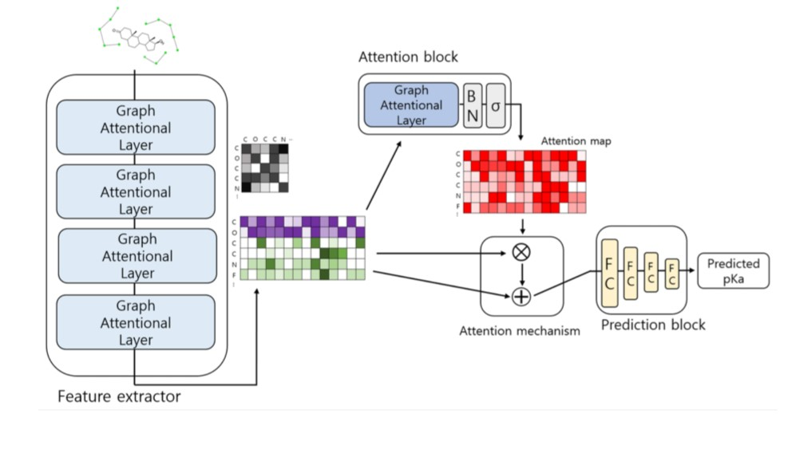
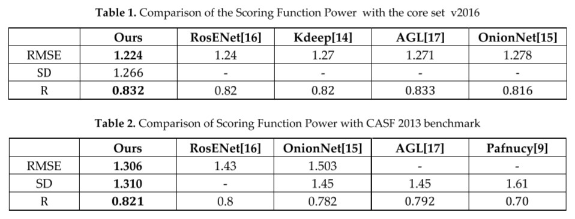
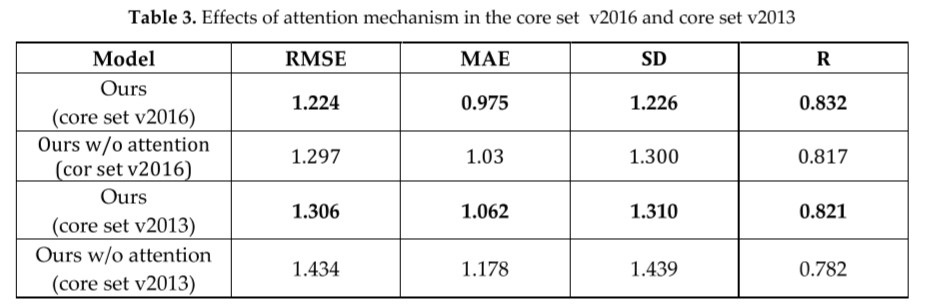

# Accurate Prediction of Protein Ligand Bindnig Affinity using Graph Neural Network with Attention

### Model Architecture 

The above model is composed of 3 parts, feature extractor, attention block, and the prediction block. The feature extractor finds task-related features. The attention block generates an attention map regarded as incorporating significant parts. The prediction block predicts binding affinity values based on hidden features passed the attention mechanism.

### Results and Discussions 

#### Comparison of the Scoring Function Power

Comparisons of scoring function power are summarized in Table 1 and Table 2. The models compared in the above two tables are the top models that were performing the best in the corresponding dataset, respectively. In Table 1, the performance of scoring function power is evaluated on the v2016 dataset, and our model achieved RMSE of 1.224 compared to 1.24 of RosENet [16] which used to be outperformance. Table 2 represents the performance on core set v2013, and also R performance of our model is 0.021 higher than RosENet [16] which used to be outperformance. Our model outperformed on respective core sets that have never trained with these sets. Especially, in the aspect of Pearson's correlation coefficient, improved R means a high linear correlation with experimental pKa.

#### Effects of attention mechanism

The significant idea of our model is improving the performance of the model via concentrating on task-related features by using an attention mechanism. In this task, intermolecular relationships and hidden node features which updated by their relationships are highlighted by the model. To analyze the effect of attention mechanism, the ablation study was conducted (see Table 3). While the node-level attention was maintained in all cases, the comparison between the presence and absence of feature-level attention was performed. On the core set v2016, our attention model is 0.073 higher RMSE than the other, and also 0.128 higher RMSE than the other on the core set v2013. Furthermore, the other metrics are improved via our attention model. It means that the attention to protein-ligand
relationship affects the prediction of binding affinity energy.
